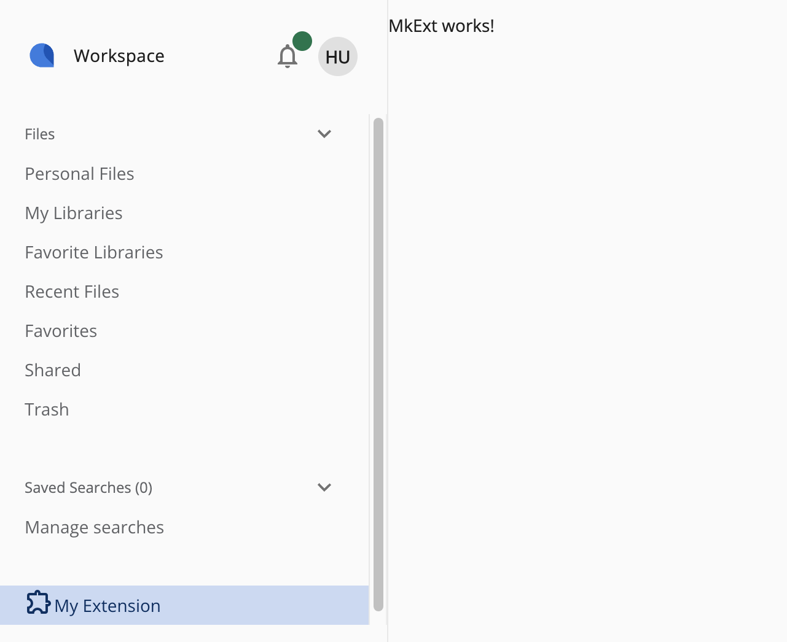

# Alfresco Front End Generators

Set of [NX based plugins with generators](https://nx.dev/features/generate-code) crafted for lightweight and fast code generation. You can explore generators for: ADF based applications, ACA and ADW extensions.

## Prerequisites
Before you start using this development framework and generators, make sure you have installed all required software:

* Install [Node.js](https://nodejs.org/en/download/) version matching the one specified in `.nvmrc` file
* Make sure to globally install NX following this guide [NX installation guide](https://nx.dev/getting-started/installation)

Every NX-based generator has to be used within the NX workspace so if you're planning to use them in the repository without NX you can simply [add NX to your repository](https://nx.dev/docs/getting-started/installation#adding-nx-to-your-repository). Alternatively if you do not have any repository already set up you can use NX to create [starter repository](https://nx.dev/docs/getting-started/installation#starter-repository).

## Installing the ADF generators plugin
Use the following command to install the ADF generators plugin:
```sh
nx add @alfresco/adf-generators
```

## Generating new ADF based application
First, move in the folder where you want create your project. Select a generator you would like to use e.g. `template-app` and run:
```sh
nx generate @alfresco/adf-generators:template-app
```
Answer couple of questions, choose the right template, authentication type and provider and the new app will be generated in folder with the same name as selected application name.

Next before running the application go to the generated folder, open `proxy.conf.js` file and provide the proper values for `ecmHost` and/or `bpmHost` variables to match your datasource (ACS/APS/Automate) instances.

In case of selecting `Automate` as template you also need to provide the right values for several variables in `app.config.json` for example:
* `APP_CONFIG_OAUTH2_HOST`
* `APP_CONFIG_OAUTH2_CLIENTID`
* `APP_CONFIG_OAUTH2_SCOPE`
* `APP_CONFIG_APPS_DEPLOYED`

 Once this is done you will need to run the following scripts:
```sh
npm install
npm start
```

## Installing the ACA generators plugin
Use the following command to install the ACA generators plugin:
```sh
nx add @alfresco/aca-generators
```

## Generating new ACA extension
If you don't have the ACA repo on your machine clone it from [Alfresco Content App GitHub](https://github.com/Alfresco/alfresco-content-app). Make sure you install the dependencies and check out the [Readme file](https://github.com/Alfresco/alfresco-content-app/blob/develop/README.md). Next move in the ACA main directory and run:
```sh
nx generate @alfresco/aca-generators:aca-extension
```
Provide the name and the directory for your new extension e.g. `MkExt` and `mk-ext` and once generator is done simply run:
```sh
npm start
```

when application is started, log in and notice the new navigation item in the menu, after clicking on it you should be navigated to `http://localhost:4200/#/mk-ext` where `mk-ext` will be path to your extension: 



## Installing the ADW generators plugin
Use the following command to install the ADW generators plugin:
```sh
nx add @alfresco/adw-generators
```

## Generating new ADW extension
If you don't have the monorepo containing ADW on your machine, check if you have required permissions and clone it. Make sure you install the dependencies. Next move in the monorepo main directory and run:
```sh
nx generate @alfresco/adw-generators:adw-extension
```
Provide the name and the directory for your new extension e.g. `MkExt` and `mk-ext` and once generator is done simply run:
```sh
npm start content-ee
```

when application is started, log in and notice the new navigation item in the menu, after clicking on it you should be navigated to `http://localhost:4200/#/mk-ext` where `mk-ext` will be path to your extension.

## Next steps
To explore ADF based application features, ACA/ADW generators and other features check out the recipes we created for you in [Recipes page](./docs/recipes/recipes.md).

If you want to contribute to the project follow instructions specified [here](./docs/developer-docs/contributing.md).
