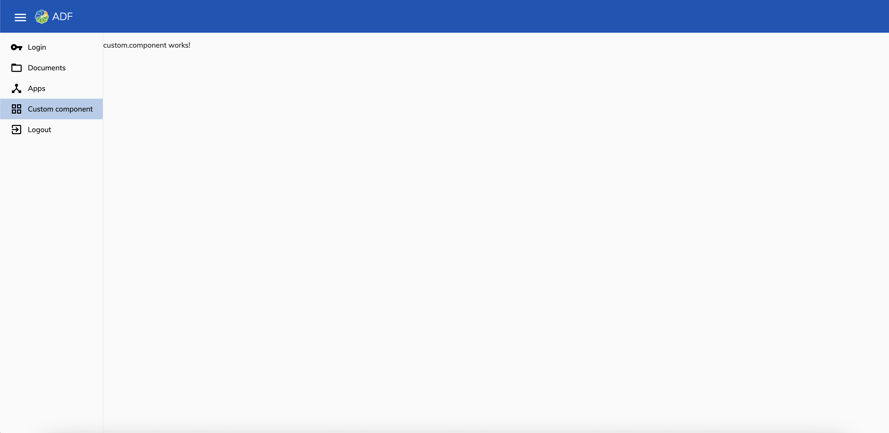
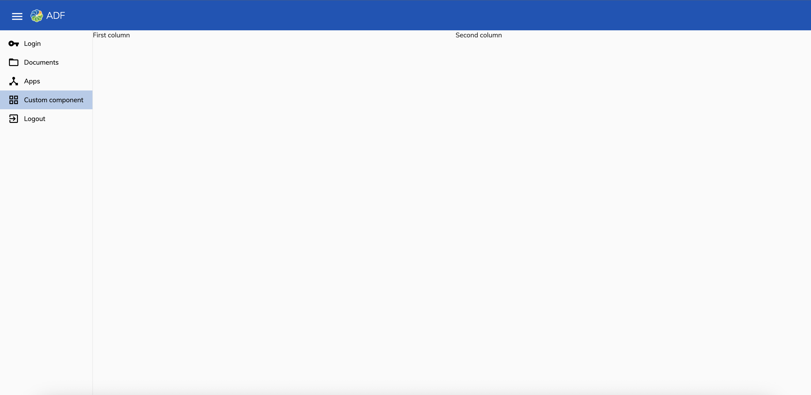
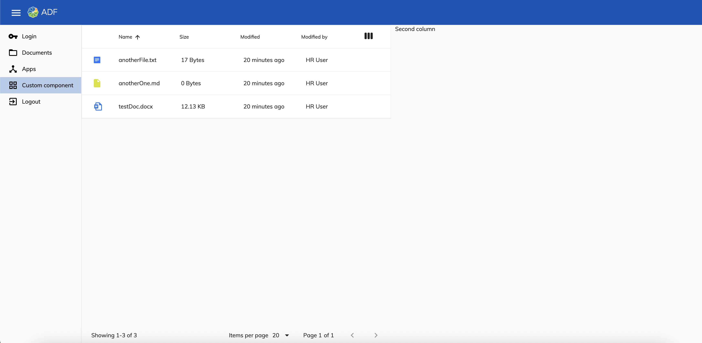
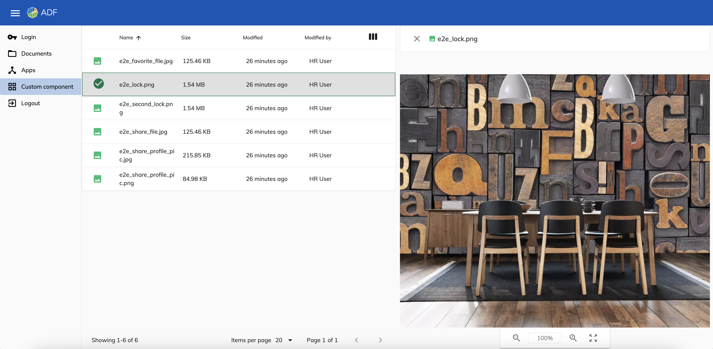

# How to add new custom page?
Adding a custom page in your application is quite simple process. Let's try to break it down into simple steps.

## Contents
- [Create new component](#create-new-component)
- [Add new route and navigation item](#add-new-route-and-navigation-item)
- [Define a layout for the component](#define-a-layout-for-the-component)
- [Integrate document list into first column](#integrate-document-list-into-first-column)
- [Add file preview into second column](#add-file-preview-into-second-column)

## Create new component
First of all we need to generate our new component, for that we can use NX's [Angular component generator](https://nx.dev/technologies/angular/api/generators/component) simply by running:

```shell
nx g @nx/angular:component src/app/custom/custom.component.ts --style="scss"
```

The only two things we need to fix manually is to adjust the generated component name from `CustomComponentComponent` to `CustomComponent` and set `encapsulation` to `ViewEncapsulation.None`.

## Add new route and navigation item
Having our component generated we can now ensure that it will be accessible for our users. Let's start be adding a new route for our component. New routes can be added by modifying `app.routes.ts`, new route can either be a root route or be a new child of any existing route, for this example our new route can be a child of our default route for `AppLayoutComponent`.
```ts
...
import { CustomComponent } from './custom/custom.component';

export const APP_ROUTES: Routes = [
  {
    path: '',
    component: AppLayoutComponent,
    children: [
      ...
      {
        path: 'custom-path',
        component: CustomComponent,
        canActivate: [AuthGuardEcm]
      },
      ...
    ],
  },
  ...
];
```

Once new route is ready we can add a new navigation item that will lead to it, we can do this by adding a new navigation list item in `AppLayoutComponent`
```html
<adf-sidenav-layout-navigation>
    <ng-template let-isMenuMinimized="isMenuMinimized">
      <mat-nav-list class="adf-sidenav-linklist">
        ...

        <a mat-list-item class="adf-sidenav-link" routerLinkActive="active" routerLink="/custom-path">
          <mat-icon matListIcon class="sidenav-menu-icon">grid_view</mat-icon>
          @if (!isMenuMinimized()) {
          <div class="sidenav-menu-label" *ngIf="!isMenuMinimized()">Custom component</div>
          }
        </a>
        ...
      </mat-nav-list>
    </ng-template>
  </adf-sidenav-layout-navigation>
```

Next for our component to support multiple languages let's add next translation key in `en.json` and other corresponding languages files
```json
{
  ...
  "CUSTOM": {
    "NAVIGATION_TITLE": "Custom component"
  },
  ...
}
```
and let's use this new translation key in our component
```html
<div class="sidenav-menu-label" *ngIf="!isMenuMinimized()">{{'CUSTOM.NAVIGATION_TITLE' | translate}}</div>
```

Result of our actions should look like this now:


## Define a layout for the component
Depending on your plan for component's layout you can take different approaches in layout planning for example you can choose [Flexbox layout](https://css-tricks.com/snippets/css/a-guide-to-flexbox/), but for the purpose of this tutorial we will do a very simple [Grid layout](https://css-tricks.com/snippets/css/complete-guide-grid/). Let's prepare our component by adding some HTML structure
```html
<div class="custom-container">
  <div class="list-container">First column</div>
  <div class="viewer-container">Second column</div>
</div>
```

then we can add a grid layout definition in `custom.component.scss`
```scss
.custom-container {
  display: grid;
  grid-template-columns: repeat(2, 1fr);
  grid-template-rows: 1fr;
  grid-column-gap: 10px;
  height: 100%;

  .list-container {
    grid-area: 1 / 1 / 2 / 2;
  }
  .viewer-container {
    grid-area: 1 / 2 / 2 / 3;
  }
}
```

with the new layout our component should look like this now:


## Integrate document list into first column
Now let's add [Document list component](https://github.com/Alfresco/alfresco-ng2-components/blob/master/docs/content-services/components/document-list.component.md) together with [Pagination component](https://github.com/Alfresco/alfresco-ng2-components/blob/master/docs/core/components/pagination.component.md) into our first column:
```html
<div class="list-container">
  <adf-document-list
    #documentList
    [currentFolderId]="'-my-'">
  </adf-document-list>
  <adf-pagination
    [target]="documentList"
    [supportedPageSizes]="[25, 50, 100]"
    [pagination]="pagination">
  </adf-pagination>
</div>
```

let's add some small styling fixes too:
```scss
.custom-container {
  ...
  height: 100%;

  .list-container {
   ...
    display: flex;
    flex-direction: column;
  }
}
```

and finally we need to add `pagination` object required by ADF pagination component in our component.
```ts
pagination: Pagination = new Pagination({
  skipCount: 0,
  maxItems: 25,
  totalItems: 0
});
```

Final result should look like this:


`Document list` offers vast amount of customization options, you can explore this more by checking out [document list docs](https://github.com/Alfresco/alfresco-ng2-components/blob/master/docs/content-services/components/document-list.component.md).

## Add file preview into second column

To get the file preview we will use [Alfresco Viewer Component](https://github.com/Alfresco/alfresco-ng2-components/blob/master/docs/content-services/components/alfresco-viewer.component.md), let's add it to our template, in case no file will be selected we can display an empty message:
```html
<div class="viewer-container">
  @if (previewNodeId) {
    <adf-alfresco-viewer
      [maxRetries]="1"
      [nodeId]="previewNodeId"
      [readOnly]="true"
      [allowNavigate]="false"
      [allowRightSidebar]="false"
      [allowPrint]="false"
      [showRightSidebar]="false"
      [allowDownload]="false"
      [allowFullScreen]="false"
      [overlayMode]="false"
      [hideInfoButton]="true"
      [showToolbarDividers]="false"
      [canNavigateBefore]="false"
      [canNavigateNext]="false" />
  } @else {
    <h2>{{ 'CUSTOM.NO_PREVIEW_FILE' | translate }}</h2>
  }
</div>
```
```json
{
  ...
  "CUSTOM": {
    ...
    "NO_PREVIEW_FILE": "Select file to preview"
  }
}
```

for starters we can have `previewNodeId` as null.
```ts
previewNodeId: string = null;
```

Next we need to react to document list selection changes to get selected node id, let's also add additional check to not try to render the viewer for folders:
```html
<adf-document-list
  #documentList
  [currentFolderId]="'-my-'"
  (nodeSelected)="onNodeSelect($event)">
</adf-document-list>
```
```ts
onNodeSelect(nodes: NodeEntry[]) {
  if (nodes[0]?.entry.isFile) {
    this.previewNodeId = nodes[0]?.entry.id;
  }
}
```

finally we need to add some styling fixes so that the viewer would be displayed properly within out container:
```scss
...
.viewer-container {
  ...
  .adf-alfresco-viewer {
    width: 100%;
    height: 100%;
    margin-right: 10px;

    .adf-viewer-inline {
      display: flex;
      width: 100%;
      height: 100%;
      position: unset;

      .adf-viewer__file-title {
        position: unset;
        transform: unset;
      }

      .adf-image-viewer {
        height: 100%;

        .adf-image-container {
          height: 100%;
        }
      }

      .adf-viewer__unknown-format-view {
        height: 100%;
      }

      .adf-viewer-render {
        &-main-loader {
          position: unset;
        }

        &-layout-content > div {
          height: 100%;
        }

        &__loading-screen {
          height: 100%;
        }
      }
    }
  }
}
```

in the end after clicking on any file from document list our viewer should look like this:

